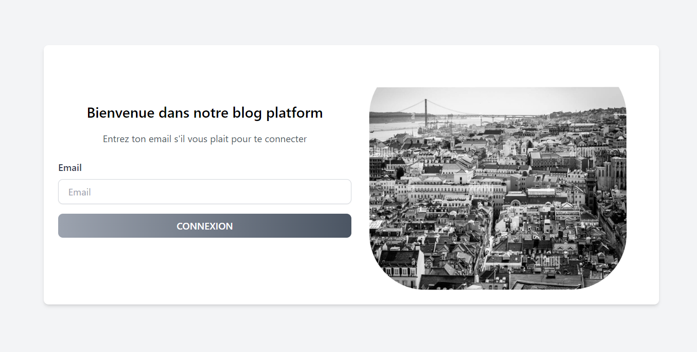
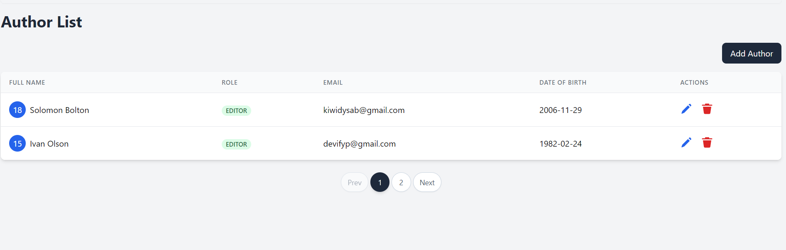
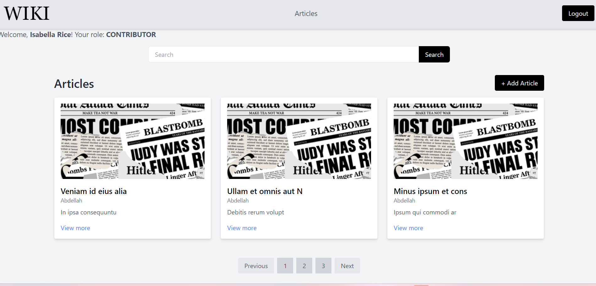
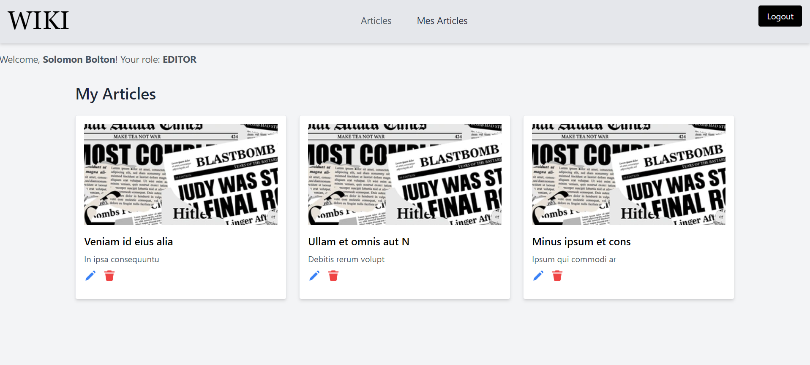
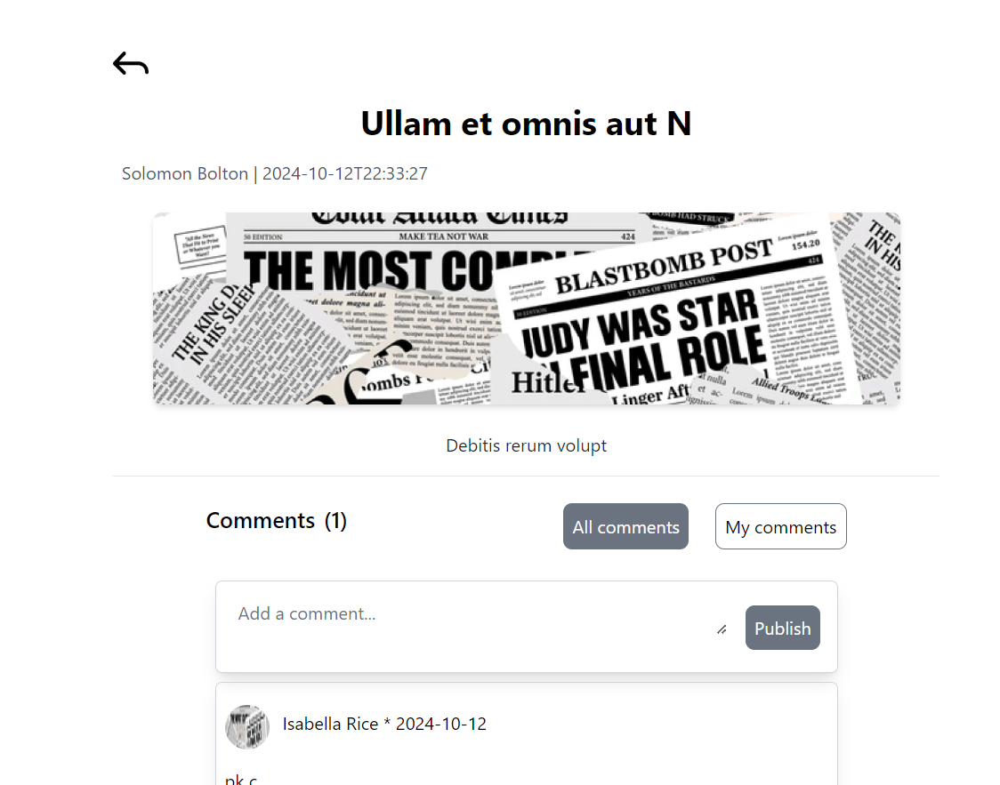
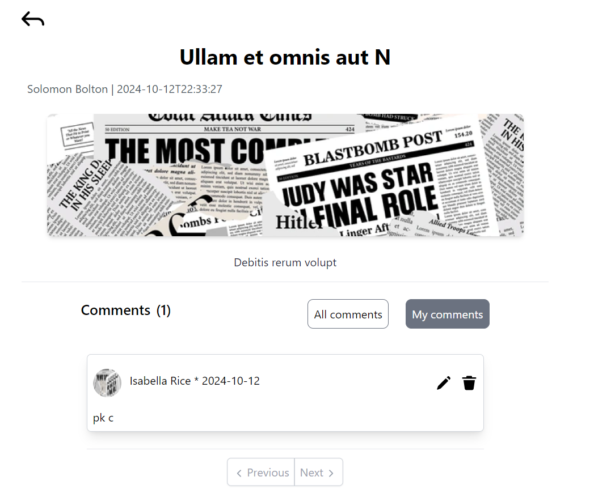

# Wiki Java Project

## Description du projet
Ce projet est une application de gestion de contenu web permettant de créer, gérer et afficher des articles, des commentaires et des auteurs. L'application utilise Java, Servlets, JSP, JSTL et Hibernate pour offrir une expérience utilisateur fluide.

## Objectif général de l'application
L'objectif principal de cette application est de permettre aux utilisateurs de publier et de gérer des articles, ainsi que d'interagir avec d'autres utilisateurs en laissant des commentaires. Cela vise à créer une plateforme collaborative pour le partage de connaissances et d'idées.

## Technologies utilisées
- **Java 8**
- **JEE**
- **Servlets**
- **JSP**
- **JSTL**
- **Hibernate**
- **Maven**
- **Tomcat**
- **SLF4J**
- **Logback**

## Structure du projet
Structure du projet
Le projet est organisé suivant une architecture MVC stricte et en couches, avec les principales sections suivantes :

- Webapp : JSP et JSTL pour l'interface utilisateur, avec des pages pour la gestion des articles et des commentaires.
- Entity : Classes Java représentant les entités (Article, Commentaire, Contributeur) avec leurs attributs.
- Servlet : Servlets pour gérer les requêtes et réponses HTTP, traitant les interactions utilisateur, notamment pour la création et l'affichage des articles et commentaires.
- Service : Contient la logique métier, y compris les services pour la gestion des commentaires et articles, et coordonne les opérations entre le contrôleur et la couche Repository.
- Repository : Gère l'accès aux données, en effectuant des opérations CRUD sur la base de données via Hibernate.


## Description brève de l'architecture adoptée
L'application suit une architecture MVC (Modèle-Vue-Contrôleur) pour séparer la logique métier, la présentation et la gestion des données. Les Servlets servent de contrôleurs pour traiter les requêtes et gérer la logique de l'application, tandis que les JSP sont utilisés pour afficher les données à l'utilisateur. Hibernate est utilisé pour interagir avec la base de données, assurant une persistance efficace des données.

## Instructions d'installation et d'utilisation

### Prérequis
- Java 8 ou supérieur
- Apache Maven
- Apache Tomcat (version 9)
- Une base de données (MySQL, PostgreSQL, etc.)

### Étapes pour configurer la base de données
1. Créez une base de données pour l'application.
2. Modifiez le fichier de configuration de connexion à la base de données dans `src/main/resources` pour refléter vos paramètres de base de données.

### Comment lancer l'application sur Tomcat
1. Exécutez la commande suivante pour construire le projet:
   ```bash
   mvn clean package
- Déployez le fichier WAR généré (wiki_java_war.war) dans le répertoire webapps de votre serveur Tomcat.
- Démarrez le serveur Tomcat.
- Accédez à l'application via votre navigateur à l'adresse suivante:

http://localhost:8080/wiki_java_war

## Captures d'écran

### Page d'Authentification


### Page de gestion des auteurs


### Page de gestion des articles



### Page de gestion des commentaires




### Améliorations futures possibles
- Implémenter un système de notifications pour les commentaires.
- Permettre aux utilisateurs de s'inscrire et de gérer leurs profils.
### Idées pour étendre ou améliorer le projet
- Intégrer un système de balisage pour les articles.
- Ajouter des fonctionnalités de filtrage et de tri pour les articles et les commentaires.
- Développer une API REST pour une intégration plus facile avec d'autres systèmes.
### Auteur et contact

Nom: [Idelkadi Radia]
GitHub: https://github.com/Radiaidel

-----------------------------------

Nom: [Talemsi Abdellah]
GitHub: https://github.com/ATalemsi

-----------------------------------
Nom: [Sebti Douae]
GitHub: https://github.com/Douaesb


Merci d'avoir consulté ce projet. Pour toute question ou suggestion, n'hésitez pas à me contacter!

